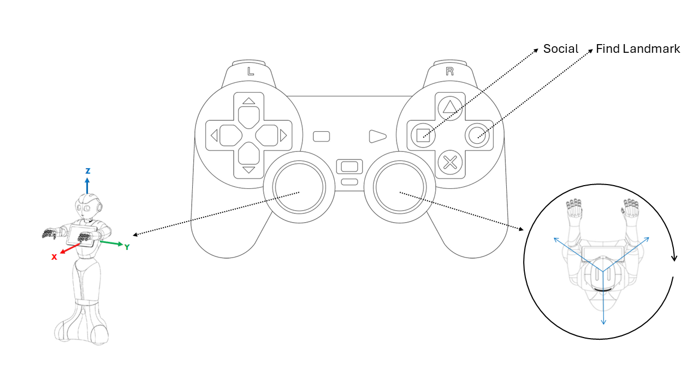

# JoystickMove 

JoystickMove allows locomotion control of the robot via a games controller. 

JoystickMove is *blocking*, meaning that you will not be able to launch additional commands from PepperWizard until you have exited JoystickMove successfully.

## Launching and Exiting JoystickMove:
### Launch JoystickMove
JoystickMove is launched with a keypress. 
* **J** - Launches JoystickMove

### Exit JoystickMove:
* **CNTRL + C** - Exits JoystickMove

## Controls:
| **Control**  | **Robot Action**|
| -------- | -------           |
| Left   joystick        | Robot will move from the robot's own reference frame.   The robot's omnidirectional wheelbase means that holonomic  motion can be achieved
| Right   joystick        | Robot will rotate clockwise or anticlockwise
| ◯ button | Launches *SocialState*
| ☐ button | Runs *Find* function

## External-collision avoidance:
External-collision avoidance aims to avoid damage to the robot, its environment, and people in its environment.

If a motion command is active while the root detects a blocking obstacle in the direction of motion, this motion will not be launched or as soon as the obstacle enters its security zone.

* Tangential Security Distance: The minium distance between any point of the robot and any obstacle during a move, by default this is 0.1 m.
* Orthogonal security distance: The frontal distance at which the robot will stop when moving directly towards an obstacle, by default 0.4 m.

At any time, the frontal stopping distance when the robot is moving towards an obstacle is proportional to the robots speed. 

| **Speed (m/s)**  | **Frontal security distance (m)**|
| -------- | -------           
| 0.10 | 0.12|
| 0.20 | 0.17|
| 0.30 | 0.25|
| 0.40 | 0.35|
| 0.50 | 0.40|
| 0.55 | 0.40

